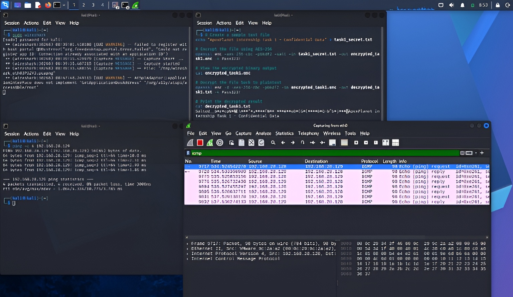

# Task 1: Foundations & Environment Setup

## Overview
- **Timeline:** Days 1-12[cite: 1]
- **Objective:** Build strong fundamentals in cybersecurity, networking, cryptography, and set up a professional hacking lab[cite: 1].

---

## 1. Cybersecurity Basics
- **CIA Triad:** Confidentiality, Integrity, and Availability[cite: 1].
- **Threat Types:** Phishing, Malware, DDoS, SQL Injection, Brute Force, and Ransomware[cite: 1].
- **Attack Vectors:** Social Engineering, Wireless Attacks, and Insider Threats[cite: 1].

---

## 2. Lab Environment Setup & Wireshark Capture
- **Hypervisor & VMs:** VirtualBox with Kali Linux and Metasploitable2/DVWA[cite: 1].
- **Network Configuration:** Host-Only Adapter setup[cite: 1].

---

## 3. Linux & Networking Fundamentals
- **Navigation & Permissions:** Used pwd, ls, cd, chmod, and chown[cite: 1].
- **Networking Commands:** Verified connectivity using ifconfig, ping, and 
etstat[cite: 1].
- **OSI Model & TCP/IP:** Explored layers, DNS, HTTP/HTTPS, and IP subnetting[cite: 1].

---

## 4. Cryptography Basics & Tool Familiarization
- **OpenSSL Hands-on:** Encrypted and decrypted confidential messages using AES-256[cite: 1].
- **Tools:** Wireshark, Nmap, Burp Suite, and Netcat[cite: 1].
